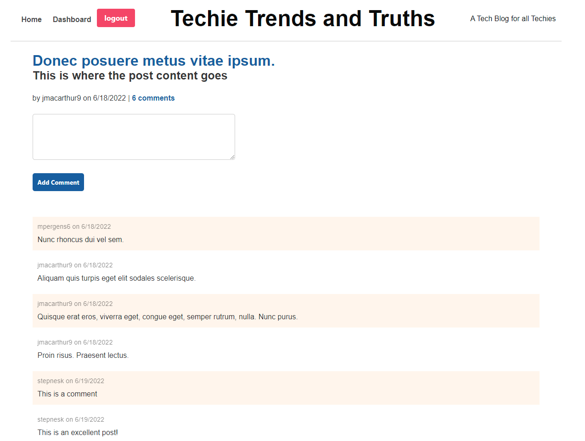

# Techie Trends and Truths
    

## Description

Techie Trends and Truths is a tech blog where users can post content for others to read and comment on.  Once a user is registered and logged in they can create new posts and comment on current posts.  This site is deployed to Heroku. It follows the MVC paradigm in its architectural structure, using Handlebars.js as the templating language, Sequelize as the ORM, and the express-session npm package for authentication.

## Table of Contents

- [Description](#description)
- [Installation](#installation)
- [Usage](#usage)
- [License](#license)
- [Contributing](#contributing)
- [Tests](#tests)
- [Questions](#questions)

## Installation

Run "npm install" to install the required packages.

## Usage

Run "npm start" from the command line and visit http://localhost:3002 or used the deployed site on Heroku at https://tranquil-hollows-06214.herokuapp.com/

## License

This application is covered by the MIT license. 

For more information about this license please visit [https://choosealicense.com/licenses/mit/]

## Contributing

There were no collaborators on this project.

## Tests

There were no tests written for this project.

## Questions

Find me on GitHub: [https://github.com/uncgirl02](https://github.com/uncgirl02)

Email me with any questions: ems1980@hotmail.com
    
